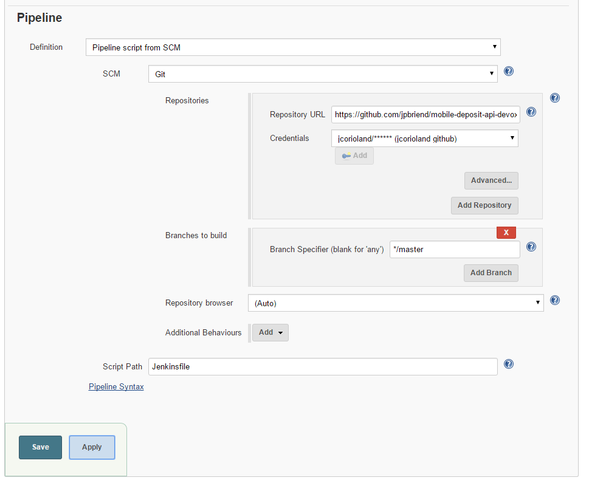
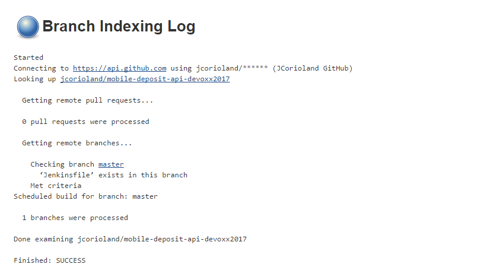

# Devoxx 2017 example application

This application is a very simple SpringBoot app.
During the Devoxx lab, you will learn how to use Jenkins Pipeline to build it, build a Docker image of the app, push it to a Docker registry, and finally deploy to a Kubernetes cluster.

## GitHub Personal Access Token

If you use Jenkins and GitHub (and this is the case in this lab), you will need to use a GitHub Personal Access Token to override the anonymous rate limits of the GitHub API.

Here is how to create a GitHub Personal Access Token:

* Login on **GitHub** with your credentials
* Go to your [Settings](https://github.com/settings/profile)
* Access the [Personal access tokens page](https://github.com/settings/tokens)
* Click on **Generate new token**
* Input your password if required
* Give a name to the token and check the following scopes:
  * repo:status
  * repo_deployment
  * public_repo
  * read:org
  * write:repo_hook
  * read:repo_hook


* Then hit the **Generate token** button
* Keep the page opened

Let's input this token in Jenkins as a Credential.
* Login on Jenkins with your provided login/password
* Go on your Master and inside your personal Folder
* Click on the **Credentials** link on the left menu
* Click on the **Folder** link which appeared
* Click on the **Global credentials (unrestricted)** link
* Click on the **Add Credentials** link
  * **Kind**: 'Username with password'
  * **Username**: input your GitHub username
  * **Password**: copy/paste the access token which was previously created
  * **Description**: input something useful such as 'Github token'


* Hit the **OK** button

With this token, you will not face any GitHub API rate limitation.

## Docker Registry credentials

You will deploy your Docker image to a private Docker Registry. Of course this registry is secured by a login and password.
Let's create another Jenkins Credential to host this sensible information
* Go on your Master and inside your personal Folder
* Click on the **Credentials** link on the left menu
* Click on the **Folder** link which appeared
* Click on the **Global credentials (unrestricted)** link
* Click on the **Add Credentials** link
  * **Kind**: 'Username with password'
  * **Username**: input your Docker registry login
  * **Password**: enter your Docker registry password
  * **id**: input 'test-registry'. This ID will be used in the Jenkins Pipeline to identify the Credential.


* Hit the **OK** button

## Kubernetes Secret key

You will deploy your application to a Kubernetes cluster. In order to do this, you will use the _kubectl_ command line, which is secured by a Secret key.
Let's input this Secret key into Jenkins as a Credential.
* Go on your Master and inside your personal Folder
* Click on the **Credentials** link on the left menu
* Click on the **Folder** link which appeared
* Click on the **Global credentials (unrestricted)** link
* Click on the **Add Credentials** link
  * **Kind**: 'Secret file'
  * **File**: select the secret key file located on your laptop
  * **ID**: input 'kuby'. This ID will be used in the Jenkins Pipeline to identify the secret.


* Hit the **OK** button

## Environment variables

Hard-coded values in a Pipeline is a bad practice.
We are going to setup some specific values as Environment Variables to keep a generic Jenkins Pipeline.
CloudBees Jenkins Enterprise enables you to setup environment variables on a folder. Its visibility will be limited to this folder and subfolders.
So each of the attendees can setup their own env. variables on their folder, without impacting each other.

* Go on your Master and inside your personal Folder
* Click on the **Configure** link on the left menu
* Scroll down to 'Environment Variables' text area and input the following variables (1 variable per line, just like a Property file):

```
DOCKER_REGISTRY=xxxxxxxxxxxx
k8s_username=xxxxxxxxxxxx
k8s_password=xxxxxxxxxxxx
k8s_tenant=xxxxxxxxxxxx
k8s_name=xxxxxxxxxxxx
k8s_resourceGroup=xxxxxxxxxxxx
```


* Hit the **Save** button

## Pipeline job

Let's create the job for our application.
It's going to be a Jenkins Pipeline, and the source code will be a fork of this repository in GitHub.
We will even use a Multibranch Pipeline job: Jenkins will scan all the branches and Pull Requests of the repository and create 1 Pipeline per branch / PR found.

* Fork this repository with your personal GitHub account.
* Go on your Master and inside your personal Folder
* Click on the **New Item** link in the left menu
* Give a name to your job
* Click on **Multibranch**
* Click on the **OK* button
* Scroll down to the **Branch Sources** part
* Click on **Add source** and select **GitHub**
* In the field **Owner**, input your GitHub username
* In the **Scan credentials** dropdown list, select the credential you previously created, which contains your GitHub access token
* In the **Repository** dropdown list, select the repository _mobile-deposit-api-devoxx2017_
* Hit the **Save** button



Jenkins is now going to scan the branches/ PR in the repository and look for Jenkinsfile files. When a Jenkinsfile is found, a Pipeline is created.
Jenkins should have detected the _master_ branch and should have started building the job.



# Checking Application is working

Just use the following URL:
```
http://xxxxxxxxxxx:8080/account/deposit
```

The result should be JSON containing the details of a bank account and the version of the component.
